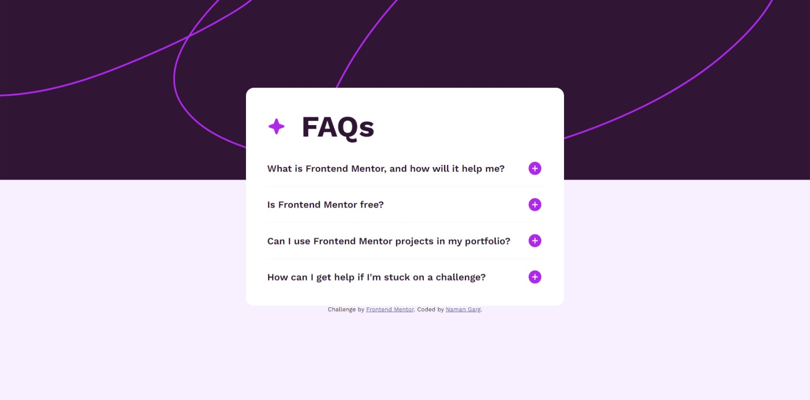
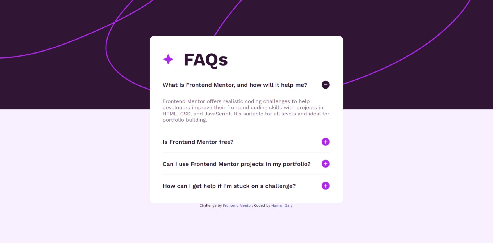

# Frontend Mentor - FAQ accordion solution

This is a solution to the [FAQ accordion challenge on Frontend Mentor](https://www.frontendmentor.io/challenges/faq-accordion-wyfFdeBwBz). Frontend Mentor challenges help you improve your coding skills by building realistic projects. 

## Table of contents

- [Overview](#overview)
  - [The challenge](#the-challenge)
  - [Screenshot](#screenshot)
  - [Links](#links)
- [My process](#my-process)
  - [Built with](#built-with)
  - [What I learned](#what-i-learned)
  - [Continued development](#continued-development)
- [Author](#author)

## Overview

### The challenge

Users should be able to:

- Hide/Show the answer to a question when the question is clicked
- Navigate the questions and hide/show answers using keyboard navigation alone
- View the optimal layout for the interface depending on their device's screen size
- See hover and focus states for all interactive elements on the page

### Screenshot




### Links

- Solution URL: [Add solution URL here](https://github.com/NamanG22/FAQ)
- Live Site URL: [Add live site URL here](https://namang22.github.io/FAQ/)

## My process

### Built with

- Semantic HTML5 markup
- CSS custom properties
- Flexbox
- CSS Grid
- JavaScript

### What I learned

Animation of container when their property changes

```css
p{
  overflow:hidden;
  transition: max-height 0.7s;
  height:auto;
}
```
```js
for(var j=0; j<arr2.length;j++){
  img[j].style.display='none';
  img2[j].style.display='block'; 
  if(arr2[j]!=ans){
      arr2[j].classList.add('hide');
  }
}
```

### Continued development

Better use of javascript

## Author

- Frontend Mentor - [@NamanG22](https://www.frontendmentor.io/profile/NamanG22)